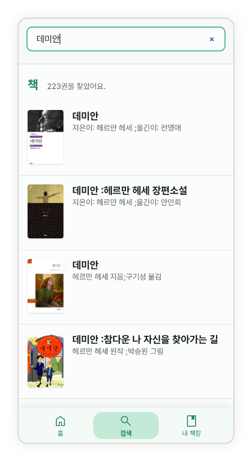
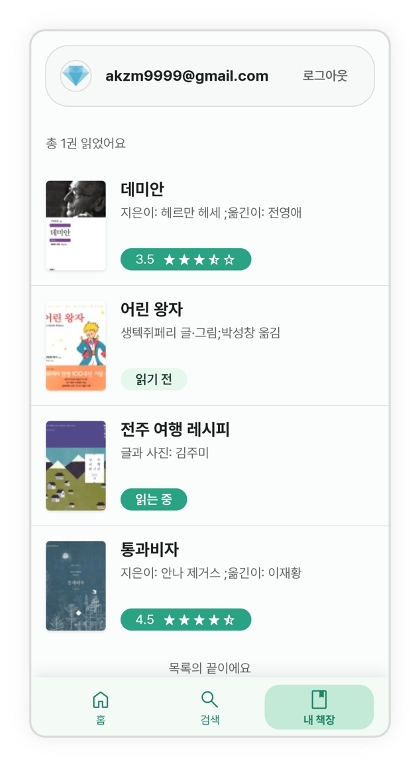
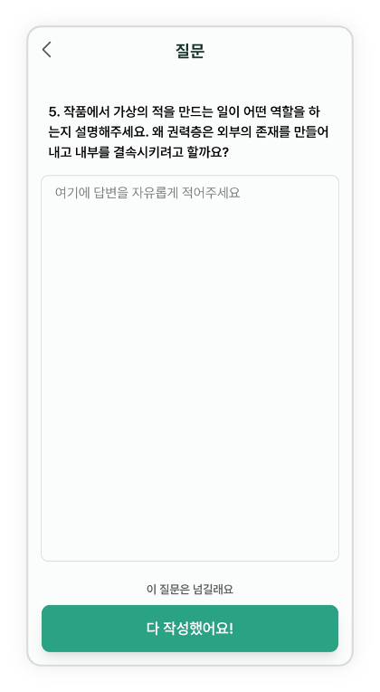
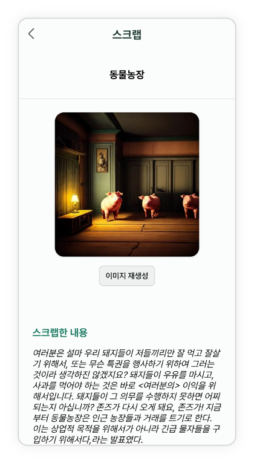
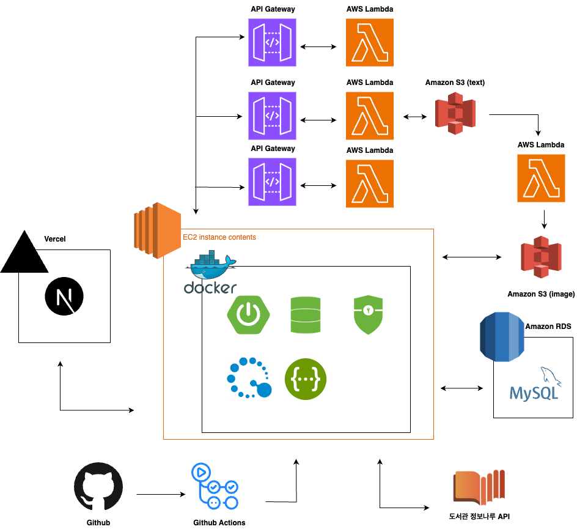

	<h1>독후감을 작성하는 재미를 느끼며 독서만의 깊은 위로와 사유의 기회를 얻을 수 있게 하는 서비스, Readiary</h1>
	 
	<!--->

# 프로젝트 소개

서비스 소개  ◇ 최근 대중들의 문해력 부족이 사회적으로 큰 화두로 떠올랐다. 이를 타개하기 위한 방법으로 독서 활동이 언급되고 있지만, 최근 국내 독서율 및 독서량은 지속적으로 낮아지고 있다. 
◇ 이에 ‘리더스’, ‘북모리’와 같은 서비스들이 제공되었으나 깊고 풍부한 독서 경험 제공에는 한계가 있다. 
◇ 매년 전자책 독서율은 증가하는 추세이며 출판 산업의 매출액은 7조 8000억 이상으로 파이가 큰 시장이다. 
◇ 이에 이번 프로젝트의 타겟층은 2~30대로 독후감을 작성하는 재미를 느끼며 독서에서만 얻을 수 있는 깊은 위로와 사유의 기회를 얻을 수 있도록 한다.  
◇ 이는 이미지 생성을 통한 시각화 전략과, 문답 전략을 통해 도서에 대한 깊이있는 고찰과 지속가능한 독서활동을 가능케할 것이라 기대한다. 

# 핵심 기능

1. 책을 검색할 수 있다.
   <!--->    

2. 나의 책장에 책을 등록할 수 있다.
   <!--->    

3. 책장 속의 책을 읽고 별점을 부여하거나 읽은 정도를 표시할 수 있다.
   <!--->     

4.  GPT 기술을 활용하여 실제 사람이 질문 한 것처럼 자연스러운 질문 생성 및 재생성이 가능하다.
   <!--->     

5. 이미지 생성 역시 Diffusion 모델을 활용하여 문맥에 맞는 자연스러운 이미지 생성이 가능하다.
   <!--->     

# 프로젝트 아키텍처

 

 
	 
	◇ 프런트엔드 시스템, 백엔드 시스템, AI 서비스 시스템, 데이터베이스 시스템 등 여러 하위 시스템들을 통합하여 하나의 완전한 서비스를 구성. 위는 이를 모식적으로 나타낸 것이다. 
	◇ 프론트엔드와 백엔드는 REST API를 사용하여 통신 
 	◇ AI는 서버리스 아키텍처로 구성 
 	◇ 백엔드와 AI는 API Gateway를 통해 통신 
 	◇ 도서관 정보나루와 백엔드가 API로 통신 
	 

 
 

# 팀원

| AI | AI | Backend | Frontend |
| :-: | :-: | :-: | :-: |
|  |  |  |  |  |
| [이경윤](https://github.com/Yooonlee)  | [배세윤]()  | [이진수](https://github.com/Relaxed-Mind)  | [전호균]()  |

  
 

# 맡은 역할
 ◇ 전호균 | 사용자 인터페이스 설계
프런트엔드 시스템 설계 및 개발
프런트엔드 서버 배포
 ◇ 이진수 ㅣ 데이터베이스 설계
API 설계 및 제작
서버 배포
 ◇ 이경윤 | 이미지 생성 
이미지 실험 
람다 배포 
 ◇ 배세윤 | 질문 생성
질문 실험
베포용 함수제작
