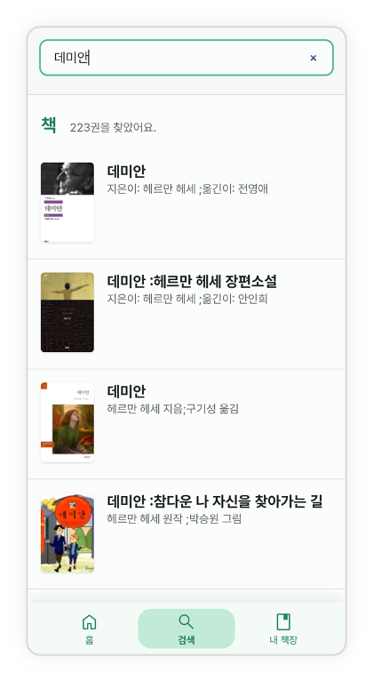
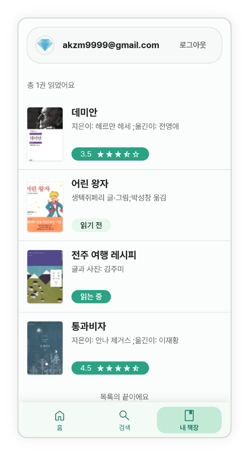
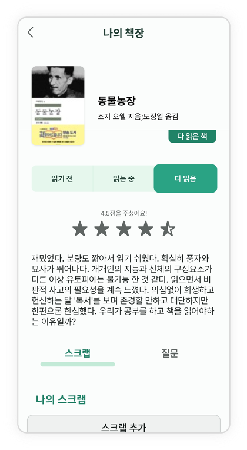
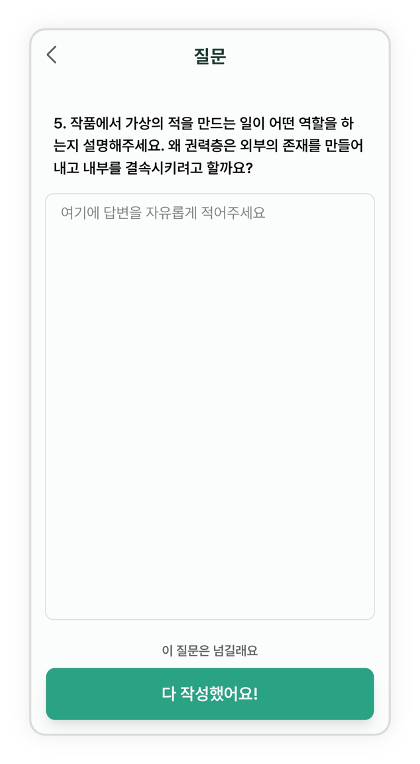
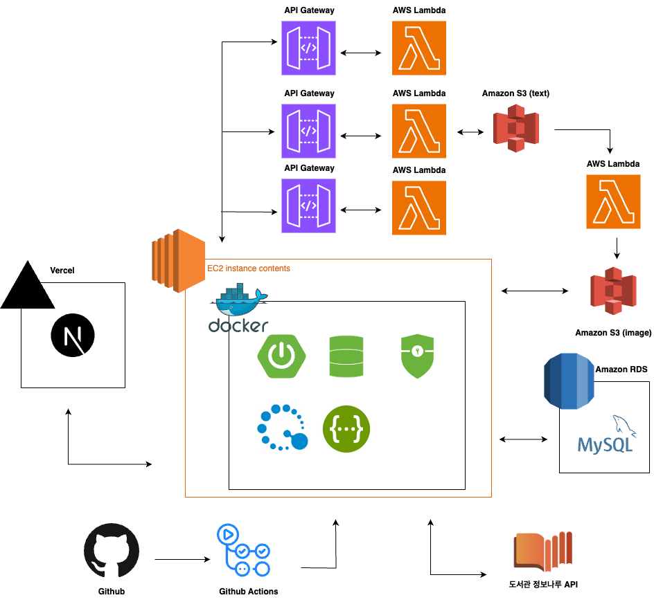
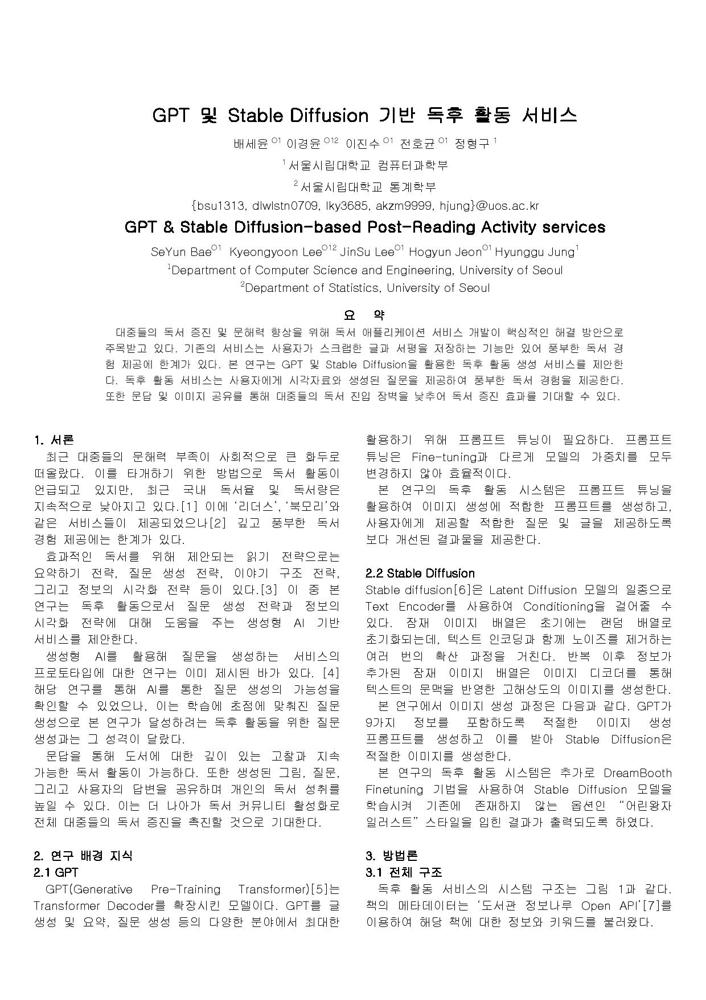
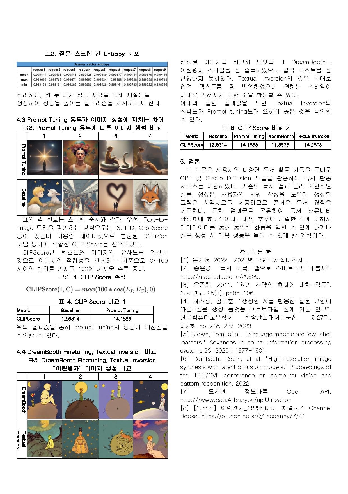

	
독후감을 작성하는 재미를 느끼며 독서만의 깊은 위로와 사유의 기회를 얻을 수 있게 하는 서비스,

   
Readiary

	<!--  -->
	

# 프로젝트 소개

### 서비스 소개

* 최근 대중들의 문해력 부족이 사회적으로 큰 화두로 떠올랐다. 이를 타개하기 위한 방법으로 독서 활동이 언급되고 있지만, 최근 국내 독서율 및 독서량은 지속적으로 낮아지고 있다.

* 이에 ‘리더스’, ‘북모리’와 같은 서비스들이 제공되었으나 깊고 풍부한 독서 경험 제공에는 한계가 있다.

* 매년 전자책 독서율은 증가하는 추세이며 출판 산업의 매출액은 7조 8000억 이상으로 파이가 큰 시장이다.

* 이에 이번 프로젝트의 타겟층은 2~30대로 독후감을 작성하는 재미를 느끼며 독서에서만 얻을 수 있는 깊은 위로와 사유의 기회를 얻을 수 있도록 한다.

* 이는 이미지 생성을 통한 시각화 전략과, 문답 전략을 통해 도서에 대한 깊이있는 고찰과 지속가능한 독서활동을 가능케할 것이라 기대한다.

# 핵심 기능

1. 책을 검색할 수 있다.

   

1. 나의 책장에 책을 등록할 수 있다.

   

1. 책장 속의 책을 읽고 별점을 부여하거나 읽은 정도를 표시할 수 있다.

   

1. GPT 기술을 활용하여 실제 사람이 질문 한 것처럼 자연스러운 질문 생성 및 재생성이 가능하다. 
   
   

1. 이미지 생성 역시 Diffusion 모델을 활용하여 문맥에 맞는 자연스러운 이미지 생성이 가능하다.

   

# 프로젝트 아키텍처

* 프런트엔드 시스템, 백엔드 시스템, AI 서비스 시스템, 데이터베이스 시스템 등 여러 하위 시스템들을 통합하여 하나의 완전한 서비스를 구성. 위는 이를 모식적으로 나타낸 것이다.
* 프론트엔드와 백엔드는 REST API를 사용하여 통신
* AI는 서버리스 아키텍처로 구성
* 백엔드와 AI는 API Gateway를 통해 통신
* 도서관 정보나루와 백엔드가 API로 통신

# 팀원

| AI | AI | Backend & Infra | Frontend |
| :-: | :-: | :-: | :-: |
|  |  |  |  |
| [이경윤](https://github.com/Yooonlee) | [배세윤](https://github.com/bsu1313)  | [이진수](https://github.com/Relaxed-Mind) | [전호균](https://github.com/hoqn)  |

## 맡은 역할

##### 공통

* 주제 선정
* 매주 보고서 작성 및 ppt 제작
* 유저 시나리오 작성
* 논문 검토 및 수정

##### 이진수

* 팀장
* 데이터베이스 설계
* API 설계 및 제작
* 백엔드 서버 배포
* 데이터베이스 배포
* 온라인 저장소 배포

##### 전호균

* 사용자 인터페이스 설계
* 프런트엔드 시스템 설계 및 개발
* 프런트엔드 서버 배포

##### 이경윤

* 이미지 생성
* 이미지 실험
* 람다 배포

##### 배세윤

* 논문 초안 작성
* 질문 생성
* 질문 실험
* 베포용 함수 제작

# 한국정보과학회 논문

